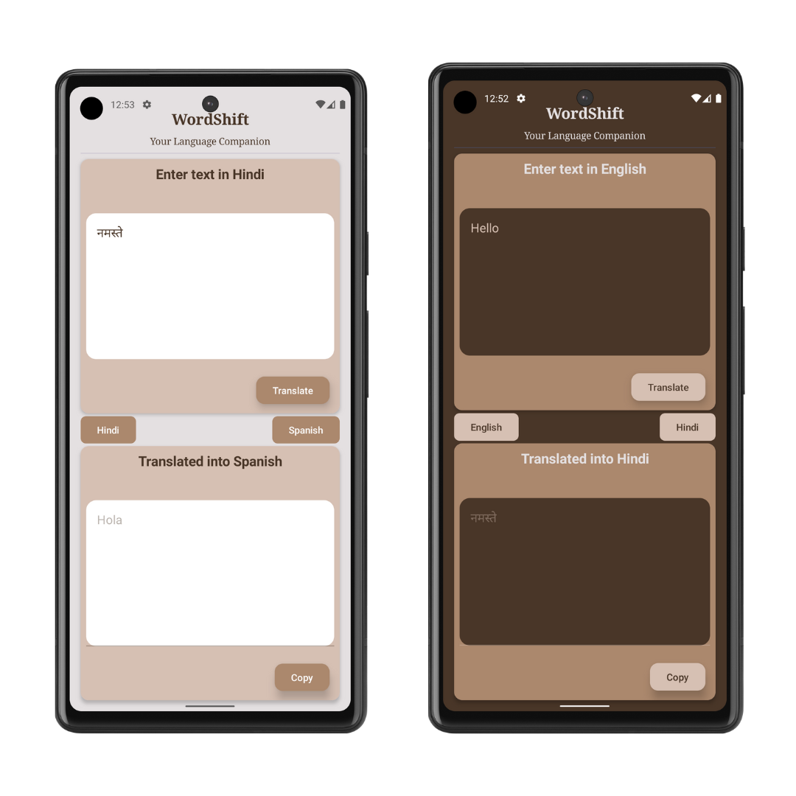

# 🌍 WordShift - Your Language Companion

[](https://developer.android.com/about/versions/android-4.0) 
[](https://kotlinlang.org) 

**WordShift** is a powerful Android application that helps you seamlessly translate text between multiple languages. Built with **Jetpack Compose** and leveraging **Firebase ML Kit**, WordShift offers real-time translations that are fast, efficient, and can work offline.

## 📸 Features

- **🌐 Instant Translation**: Translate text between several languages in real-time.
- **⚡ On-Device Performance**: Uses Firebase ML Kit for quick translations, allowing offline functionality after downloading models.
- **🎨 Dynamic Themes**: Adapts to dynamic themes based on your device's wallpaper or color palette for Android 13 and above.
- **💻 User-Friendly Interface**: A sleek, modern UI powered by Jetpack Compose for an intuitive user experience.

## 📱 Screenshots

  

## 🚀 Getting Started

### Prerequisites

- **Android Studio**: Make sure you have Android Studio installed on your machine.
- **Basic Knowledge**: Familiarity with Kotlin and Android development is recommended.

### Installation Steps

1. **Clone the Repository**:
   ```bash
   git clone https://github.com/yourusername/WordShift.git
   cd WordShift
   ```

2. **Open Project in Android Studio**.

3. **Add Dependencies**: Include the following dependencies in your `build.gradle` file:
   ```groovy
   dependencies {
       implementation 'com.google.mlkit:translate:2.0.0'
       implementation 'androidx.compose.ui:ui:1.3.0'
       implementation 'androidx.compose.material3:material3:1.0.0-alpha03'
       implementation 'androidx.activity:activity-compose:1.6.0'
   }
   ```

4. **Sync Gradle**: Sync your project with the Gradle files.

5. **Run the App**: Launch the app on an emulator or physical device to start translating!

## 📖 Usage Instructions

1. Select your **source** and **target** languages from the dropdown menus.
2. Enter the text you wish to translate in the input field.
3. Click the **"Translate"** button to display the translated text instantly!

## 🤝 Contributing

We welcome contributions! If you find any issues or want to suggest improvements, please open an issue or submit a pull request.
